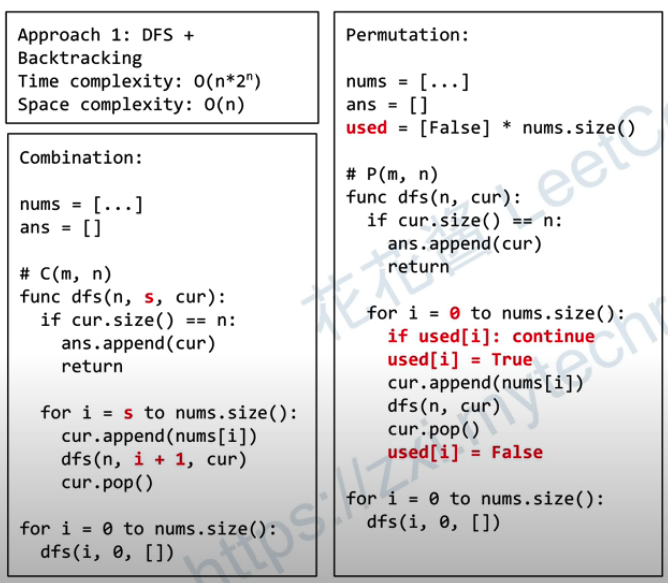
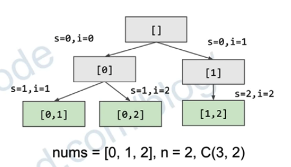

# 
https://www.youtube.com/watch?v=us0cYQXQpxg&ab_channel=Coderbyte


Permutation is a collection of items where the order matters

Combination is a collection of items where the order does NOT matters


## DFS + Backtracking Template



Combination 的递归函数需要记录start position, 因为原数组中较先出现的元素要在结果中先出现

Permutation 的递归函数不需要需要记录start position, 每次都从0开始
```
Solution: DFS
Time complexity: O(n!)
Space complexity: O(n)
```

```
  ans.push_back(cur);
```
等于 C++ push_back 会自动copy curr, 
对于javascipt， python 要注意手动copy，


## resources
https://zxi.mytechroad.com/blog/searching/leetcode-78-subsets/ [一定要看]