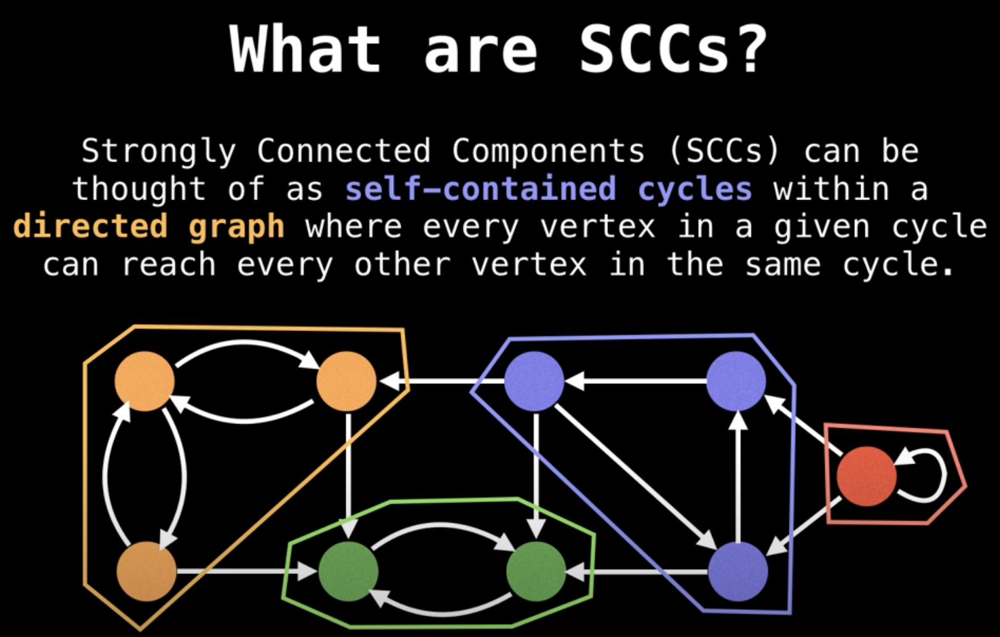
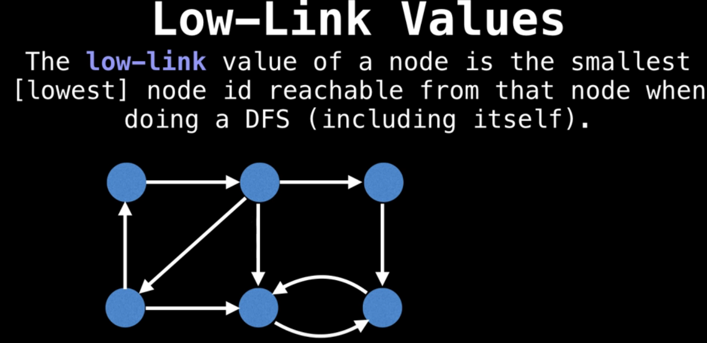

前提是 所有 node 已 连接在一起

去掉一个 Critical Connection会变成两graph

环上的任何一条边都不是 critical connection

从0开始，使用DFS向前探索，记录当前的步数

如果current node 的child的step比current 的step还小，说明child和current的祖先连接，说明有环

Time O(N)
Space O(N)

-Tarjans Strongly Connected Components algorithm | Graph Theory
https://www.youtube.com/watch?v=TyWtx7q2D7Y&ab_channel=WilliamFiset

