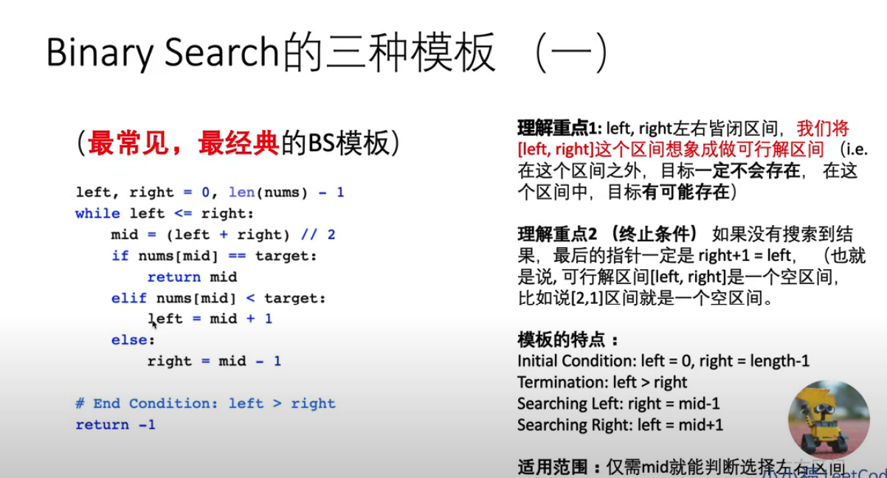
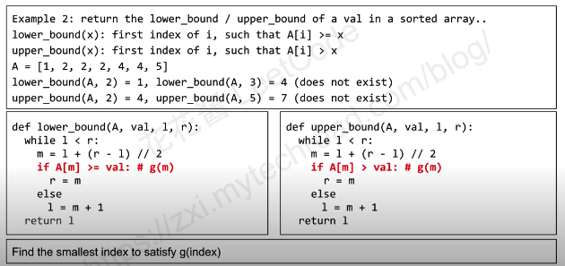

- 花花酱 LeetCode Binary Search
https://www.youtube.com/watch?v=v57lNF2mb_s&t=362s&ab_channel=HuaHua

- 花花酱 LeetCode Binary Search II - 刷题找工作 SP 17
https://www.youtube.com/watch?v=J-IQxfYRTto&t=205s&ab_channel=HuaHua

- 二分查找为什么总是写错？
https://www.youtube.com/watch?v=JuDAqNyTG4g

- 硅谷工程师十五分钟带你全面理解 Binary Search 
https://www.youtube.com/watch?v=U3U9XMtSxQc

## 特征
Input was sorted.

解有可能不存在

## Template [l, r)

f(m) 判断是否为解

g(m) 判断解在左边或右边

最终找到的 l是最小数使得g(m)为true/ 满足g(m)

## Template [l, r]

## Terminal condition

## lower / upper bound

## Sample

