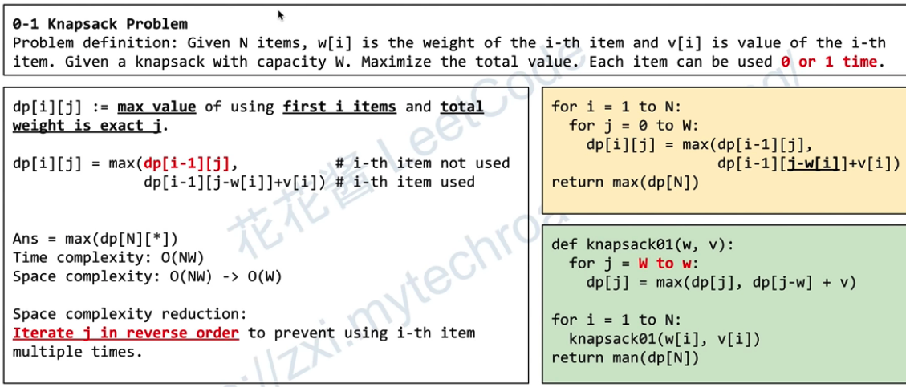

0-1 means each item can be use 0 or 1 time.

## DFS tempalte

dfs 从第s个元素, current weight = 0, current value = 0 开始选择
无需排序

## Resources
- 花花酱 0-1 Knapsack Problem 01背包问题 - 刷题找工作 SP10
https://www.youtube.com/watch?v=CO0r6kcwHUU&ab_channel=HuaHua

- 花花酱 Knapsack Problem 背包问题 2 - 刷题找工作 SP11
https://www.youtube.com/watch?v=rM_G4dboKhc&ab_channel=HuaHua

- 0/1 Knapsack Problem Dynamic Programming
https://www.youtube.com/watch?v=149WSzQ4E1g&ab_channel=TusharRoy-CodingMadeSimple 